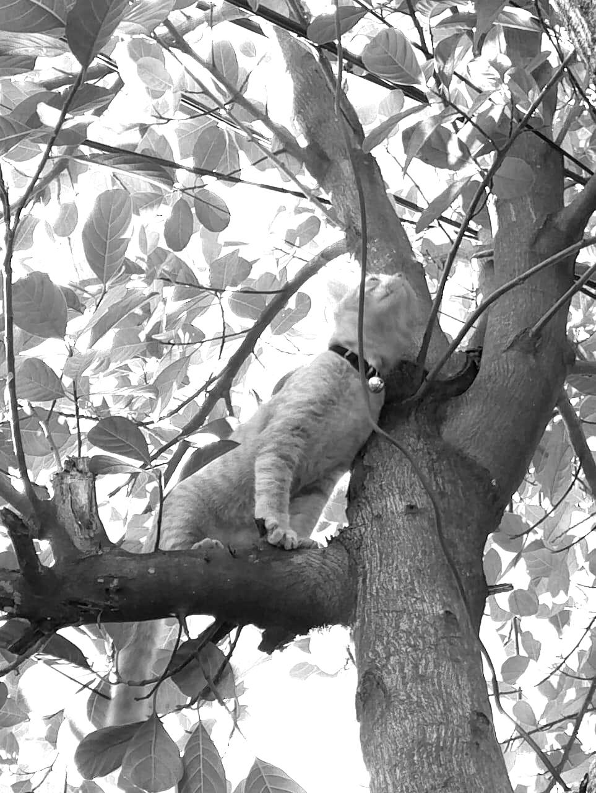

Achmad Khosyi' Assajjad Ramandanta

5025211007

Human Vision & Enhancement

# Pemrograman Perbaikan Citra dalam Domain Spasial
Terdapat tiga metode Image Enhancement yang digunakan di Domain Spasial:
- Point Processing
- Histogram Equalization
- Contrast Limited Adaptive Histogram Equalization (CLAHE)

Pada pengujian kali ini, saya menggunakan gambar hitam putih. Sebelumnya saya mempunyai gambar `mycat.jpg` yang akan saya ubah menjadi gambar hitam putih `mycat_grayed.jpg`
```
def convert_to_grayscale(image_path):
    img = Image.open(image_path).convert("L")
    return img

def save_grayscale_image(image_path):
    filename = os.path.basename(image_path)
    name, ext = os.path.splitext(filename)
    gray_img = convert_to_grayscale(image_path)
    
    new_filename = f"{name}_grayed{ext}"
    new_path = os.path.join("Output/Grayed", new_filename)
    
    gray_img.save(new_path)
    print(f"Grayscale image saved to: {new_path}")

save_grayscale_image(image_path)
```
Gambar Asli:


Gambar Hitam Putih


## Point Processing
Point processing adalah teknik yang memproses setiap piksel pada citra secara individual tanpa memperhitungkan tetangga pikselnya. Fungsi transformasi diterapkan langsung pada setiap piksel, misalnya, untuk meningkatkan kecerahan, mengubah kontras, atau menyesuaikan intensitas warna. Dalam metode Point Processing, terdapat beberapa contoh Image Enhancement:
- Negative Image
- Contrast Stretching
- Clipping
- Logarithmic Transformation
- Power Law Transformation

### Negative Image
Dalam metode Negative Image, pertama-tama gambarnya diubah menjadi array menggunakan library numpy dalam python. Kemudian menggunakan rumus `negative = 255 - pixel_value` lalu mengembalikan arraynya menjadi gambar.
```
def negative_image(image_path):
    img = Image.open(image_path)
    img_array = np.array(img) # Image to Array
    
    negative_img_array = 255 - img_array  # negative = 255 - pixel_value
    
    negative_img = Image.fromarray(negative_img_array) # Back to Image from array
    return negative_img
```


### Contrast Stretching
Dalam metode Contrast Stretching, seperti sebelumnya gambarnya diubah menjadi array lalu menentukan nilai maksimum dan minimun dan menggunakan rumus `(pixel - min) * (255 / (max - min))` lalu dikembalikan menjadi gambar.
```
def contrast_stretching(image_path):
    img = Image.open(image_path)
    img_array = np.array(img).astype('float') # Image to Array

    min_val = np.min(img_array)
    max_val = np.max(img_array)

    # Contrast stretching formula: (pixel - min) * (255 / (max - min))
    stretched_img_array = (img_array - min_val) * (255 / (max_val - min_val))
    stretched_img_array = np.clip(stretched_img_array, 0, 255)

    # Back to Image from array
    stretched_img = Image.fromarray(stretched_img_array.astype('uint8'))
    return stretched_img
```


### Clipping
Dalam metode Clipping, seperti sebelumnya gambarnya diubah menjadi array lalu memotong nilai pixel yang lebih besar dari `clip_value` dan dinormalisasikan ke rantang `0-255` lalu dikembalikan menjadi gambar.
```
def clipping_image(image_path, clip_value=150):
    img = Image.open(image_path)
    img_array = np.array(img)  # Image to Array

    # Clipping: Cuts pixel values ​​that are greater than clip_value
    clipped_img_array = np.clip(img_array, 0, clip_value)
    clipped_img_array = (clipped_img_array / clip_value) * 255

    # Back to Image from array
    clipped_img = Image.fromarray(clipped_img_array.astype('uint8'))
    return clipped_img
```



### Logarithmic Transformation
Dalam metode Logarithmic Transformation, seperti sebelumnya gambarnya diubah menjadi array lalu menggunakan rumus `c * log(1 + pixel_value)` dan dinormalisasikan ke rantang `0-255` lalu dikembalikan menjadi gambar.
```
def log_transformation(image_path, c=1):
    img = Image.open(image_path)
    img_array = np.array(img).astype('float') # Image to Array

    # Log transformation formula: c * log(1 + pixel_value)
    log_img_array = c * np.log1p(img_array)
    log_img_array = (log_img_array / np.max(log_img_array)) * 255

    # Back to Image from array
    log_img = Image.fromarray(log_img_array.astype('uint8'))
    return log_img
```


### Power Law Transformation
Dalam metode Power Law Transformation, seperti sebelumnya gambarnya diubah menjadi array lalu menggunakan rumus `c * pixel_value ^ gamma` dan dinormalisasikan ke rantang `0-255` lalu dikembalikan menjadi gambar.
```
def power_law_transformation(image_path, gamma=1.0, c=1):
    img = Image.open(image_path)
    img_array = np.array(img).astype('float') # Image to Array

    # Power law transformation formula: c * pixel_value ^ gamma
    power_img_array = c * np.power(img_array, gamma)
    power_img_array = (power_img_array / np.max(power_img_array)) * 255

    # Back to Image from array
    power_img = Image.fromarray(power_img_array.astype('uint8'))
    return power_img
```


## Histogram Equalization
Histogram Equalization adalah teknik untuk meningkatkan kontras dalam citra dengan mendistribusikan intensitas piksel secara lebih merata ke seluruh rentang intensitas yang tersedia. Teknik ini bekerja dengan mengubah histogram citra sehingga semua intensitas piksel (dari hitam ke putih) terdistribusi secara lebih merata, yang memungkinkan detail di area terang maupun gelap menjadi lebih jelas.

Seperti pada Point Processing, pertama-tama gambar diubah menjadi array lalu dengan menggunakan exposure dari library skimage di python, gambar dapat dienhance sesuai dengan kalkulasi Histogram Equalization lalu dikembalikan menjadi gambar.
```
def histogram_equalization(image_path):
    img = Image.open(image_path)
    img_array = np.array(img) # Image to Array

    # calculation using skimage
    img_equalized_array = exposure.equalize_hist(img_array) * 255
    img_equalized_array = np.clip(img_equalized_array, 0, 255).astype('uint8')

    # Back to Image from array
    img_equalized = Image.fromarray(img_equalized_array)
    return img_equalized
```


## Contrast Limited Adaptive Histogram Equalization (CLAHE)
CLAHE adalah versi yang lebih canggih dari histogram equalization. Teknik ini dirancang untuk mengatasi masalah over-enhancement (peningkatan berlebihan) yang kadang-kadang terjadi pada histogram equalization standar, terutama di area yang sudah memiliki kontras tinggi. CLAHE membagi citra menjadi blok atau area kecil (disebut "tiles") dan melakukan histogram equalization pada setiap blok tersebut. Setelah itu, blok-blok ini digabungkan dengan cara interpolasi agar peralihan antara blok-blok tidak terlalu kasar.

Metode ini menggunakan OpenCV untuk membaca gambarnya, lalu menerapkan CLAHE pada gambar.
```
def clahe_enhancement(image_path):
    # OpenCV
    img = cv2.imread(image_path, cv2.IMREAD_GRAYSCALE)
    
    # Make the CLAHE object
    clahe = cv2.createCLAHE(clipLimit=2.0, tileGridSize=(8, 8))
    
    # CLAHE Implementation
    clahe_img = clahe.apply(img)
    
    # Back to Image from array
    clahe_img_pil = Image.fromarray(clahe_img)
    return clahe_img_pil
```


# Perbandingan Gambar Point Processing


